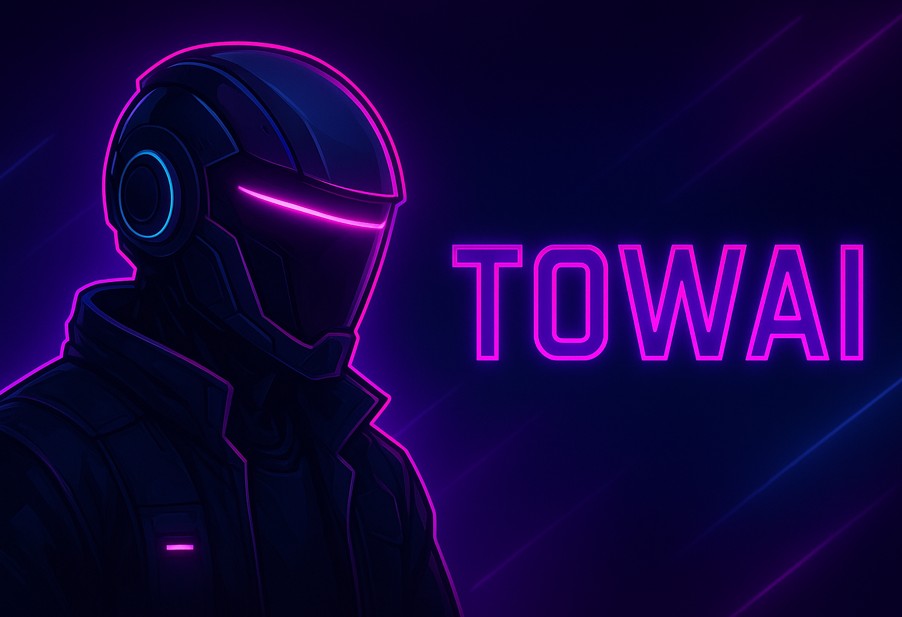

# TOWAI
<!-- ⚡ TOWAI - GitHub Professional Profile -->


<h1 align="center">⚡ TOWAI ⚡</h1>
<h3 align="center">AI Systems Architect | Fullstack Engineer | Security Specialist</h3>

<p align="center">
  
  
  
</p>

---

### 🧠 About Me

```js
const TOWAI = {
  role: "System & AI Architect / Fullstack Developer / Security Engineer",
  mindset: "Think Deep. Build Precise. Execute Perfect.",
  domains: [
    "AI & Machine Learning Systems",
    "Fullstack Web + API Architecture",
    "Security & Reverse Engineering",
    "System & OS Development"
  ],
  languages: ["TypeScript", "Python", "Rust", "Go", "C/C++", "Node.js", "Bash"],
  env: ["Linux", "Docker", "Kubernetes", "Nginx", "Vite", "Bun"]
};

